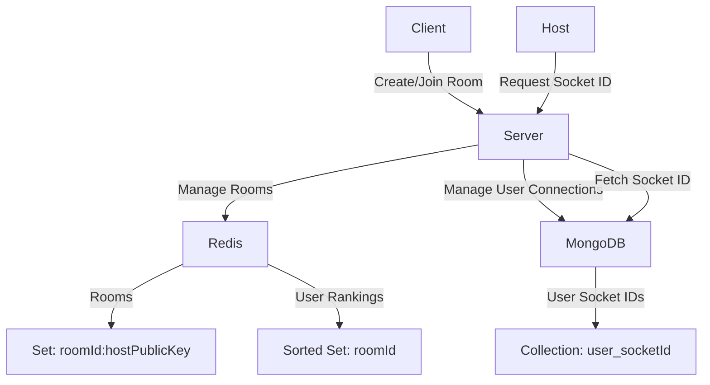

This server is not complete. I am currently using an in-memory server, but I am updating it to this architecture.

# Server Architecture

Our Chrome extension backend uses a combination of WebSocket communication, in-memory data storage, and persistent database storage to manage rooms, user rankings, and WebRTC connections. Below is a overview of the server architecture:

