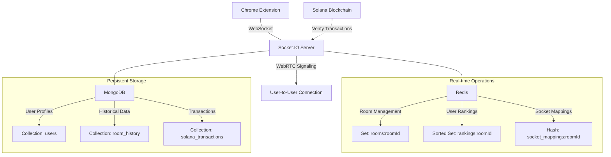

This server is not complete. I am currently using an in-memory server, but I am updating it to this architecture.

# Server Architecture

Our Chrome extension backend uses a combination of WebSocket communication, in-memory data storage, and persistent database storage to manage rooms, user rankings, and WebRTC connections. Below is a high-level overview of the server architecture:

## Key Components

1. **Socket.IO Server**: Handles real-time communication between clients and the server.
2. **Redis**: Used for fast, in-memory operations such as room management, user rankings, and socket mappings.
3. **MongoDB**: Used for persistent storage of user profiles, historical data, and transaction logs.
4. **Solana Blockchain**: Integrated for transaction verification.
5. **WebRTC Signaling**: Facilitates direct user-to-user connections.

## Main Operations

- **Room Creation/Joining**: Utilizes Redis for quick room management and user tracking.
- **Solana Transactions**: Verifies transactions with the Solana Blockchain and updates user rankings in real-time.
- **WebRTC Signaling**: Uses socket mappings in Redis to facilitate direct connections between users.
- **Disconnection/Reconnection Handling**: Manages user status across Redis and MongoDB for seamless user experience.

This architecture allows for fast real-time operations, persistent data storage, scalable WebSocket connections, and integration with the Solana blockchain for cryptocurrency transactions.